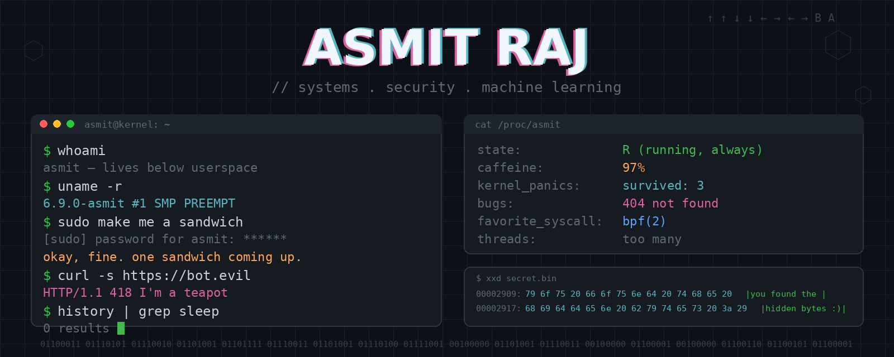

<p align="center">
  
</p>

---

## 👨‍💻 About Me

```bash
$ whoami
CS undergrad who likes working close to the metal —
kernels, packets, and the ML models that watch them.
```

I enjoy building things at the intersection of **systems programming, security, and machine learning** — the lower in the stack, the better.

* 🐧 Linux internals & kernel programming
* 🔐 Network & application security
* 🤖 Machine learning for threat detection
* ⚡ High-performance networking
* 📖 Research & open source

---

## 🚀 Current Focus

* eBPF and in-kernel packet processing (XDP, TC, LSM)
* ML-driven anomaly and attack detection
* Multi-agent AI systems
* Reading more kernel code than is probably healthy

---

## 🛠️ Tech Stack

### Languages
<p>
  
</p>

### Systems & Tools
<p>
  
</p>

### ML & Web
<p>
  
</p>

---

## 🌱 Philosophy

> *"The best way to learn is to build. The best way to improve is to share."*

---

## 📫 Connect with Me

<p align="left">
  <a href="https://www.linkedin.com/in/asmitraj29/">LinkedIn</a> •
  <a href="mailto:asmitrajcse@gmail.com">Email</a>
</p>

---

<p align="center">
  Thanks for visiting! ⭐ Feel free to explore my repositories.
</p>
